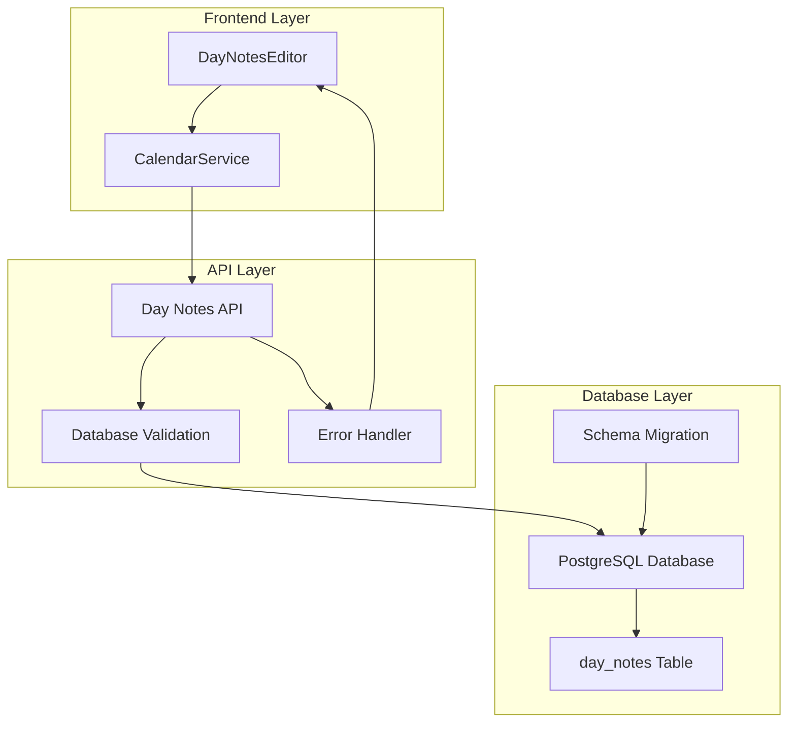

# Calendar Day Notes Persistence Fix - Design

## Overview

This design addresses the critical issue where calendar day notes appear to save successfully but don't persist in the database. The root cause is likely a missing or misconfigured `day_notes` table in the database schema. The solution involves database schema validation, proper error handling, and robust persistence mechanisms.

## Architecture

### System Components



### Data Flow

1. **Save Flow**: Editor → Service → API → Schema Check → Database → Response
2. **Load Flow**: Service → API → Schema Check → Database → Cache → Response
3. **Error Flow**: Any Layer → Error Handler → User Notification → Retry Logic

## Components and Interfaces

### 1. Database Schema Validator

**Purpose**: Ensure the day_notes table exists and is properly configured

```typescript
interface SchemaValidator {
  validateDayNotesTable(): Promise<boolean>;
  createDayNotesTable(): Promise<void>;
  checkTableIndexes(): Promise<boolean>;
  repairSchema(): Promise<void>;
}
```

**Implementation**:
- Check for table existence on server startup
- Validate required columns and data types
- Create missing indexes automatically
- Provide repair mechanisms for corrupted schema

### 2. Enhanced Day Notes API

**Purpose**: Robust API endpoints with proper validation and error handling

```typescript
interface DayNotesAPI {
  // GET /api/calendar/day-notes/:date
  getDayNotes(date: string): Promise<{ notes: string }>;
  
  // PUT /api/calendar/day-notes/:date
  saveDayNotes(date: string, notes: string): Promise<{ success: boolean; data: any }>;
  
  // POST /api/calendar/day-notes/validate-schema
  validateSchema(): Promise<{ valid: boolean; issues: string[] }>;
}
```

**Enhanced Features**:
- Schema validation before each operation
- Detailed error responses with actionable messages
- Automatic retry logic for transient failures
- Request/response logging for debugging

### 3. Improved Calendar Service

**Purpose**: Enhanced client-side service with better error handling

```typescript
interface EnhancedCalendarService {
  saveDayNotes(date: Date, notes: string): Promise<void>;
  getDayNotes(date: Date): Promise<string>;
  validateConnection(): Promise<boolean>;
  retryFailedSaves(): Promise<void>;
}
```

**New Features**:
- Connection validation before operations
- Automatic retry with exponential backoff
- Local storage fallback for offline scenarios
- Detailed error reporting to user interface

### 4. Day Notes Editor Enhancements

**Purpose**: Better user feedback and error handling in the editor

```typescript
interface EditorEnhancements {
  showSaveStatus(status: 'saving' | 'saved' | 'error'): void;
  handleSaveError(error: Error): void;
  enableOfflineMode(): void;
  syncPendingChanges(): Promise<void>;
}
```

## Data Models

### Database Schema

```sql
-- Enhanced day_notes table with proper constraints
CREATE TABLE IF NOT EXISTS day_notes (
    id SERIAL PRIMARY KEY,
    date DATE NOT NULL UNIQUE,
    notes TEXT NOT NULL DEFAULT '',
    created_at TIMESTAMP WITH TIME ZONE DEFAULT CURRENT_TIMESTAMP,
    updated_at TIMESTAMP WITH TIME ZONE DEFAULT CURRENT_TIMESTAMP,
    version INTEGER DEFAULT 1,
    checksum VARCHAR(64) -- For data integrity validation
);

-- Optimized indexes
CREATE INDEX IF NOT EXISTS idx_day_notes_date ON day_notes(date);
CREATE INDEX IF NOT EXISTS idx_day_notes_updated_at ON day_notes(updated_at);
CREATE INDEX IF NOT EXISTS idx_day_notes_checksum ON day_notes(checksum);

-- Update trigger for updated_at
CREATE OR REPLACE FUNCTION update_day_notes_updated_at()
RETURNS TRIGGER AS $$
BEGIN
    NEW.updated_at = CURRENT_TIMESTAMP;
    NEW.version = OLD.version + 1;
    RETURN NEW;
END;
$$ LANGUAGE plpgsql;

CREATE TRIGGER day_notes_updated_at_trigger
    BEFORE UPDATE ON day_notes
    FOR EACH ROW
    EXECUTE FUNCTION update_day_notes_updated_at();
```

### API Response Models

```typescript
interface DayNotesResponse {
  success: boolean;
  data?: {
    date: string;
    notes: string;
    updated_at: string;
    version: number;
  };
  error?: {
    code: string;
    message: string;
    details?: any;
  };
}

interface SchemaValidationResponse {
  valid: boolean;
  issues: string[];
  repairActions: string[];
}
```

## Error Handling

### Error Categories

1. **Schema Errors**: Missing table, incorrect columns, missing indexes
2. **Connection Errors**: Database unavailable, network issues
3. **Data Errors**: Invalid JSON, content too large, encoding issues
4. **Concurrency Errors**: Multiple users editing same date

### Error Recovery Strategies

```typescript
class ErrorRecoveryManager {
  async handleSchemaError(error: SchemaError): Promise<void> {
    // Attempt automatic schema repair
    await this.repairSchema();
    // Retry original operation
    await this.retryOperation();
  }
  
  async handleConnectionError(error: ConnectionError): Promise<void> {
    // Enable offline mode
    await this.enableOfflineMode();
    // Store changes locally
    await this.storeLocally();
    // Schedule retry when connection restored
    this.scheduleRetry();
  }
  
  async handleDataError(error: DataError): Promise<void> {
    // Validate and sanitize data
    const cleanData = await this.sanitizeData(error.data);
    // Retry with clean data
    await this.retryWithCleanData(cleanData);
  }
}
```

### User-Facing Error Messages

- **Schema Issue**: "Setting up day notes storage... Please wait."
- **Connection Issue**: "Saving offline. Will sync when connection restored."
- **Data Issue**: "Note format corrected and saved successfully."
- **Unknown Issue**: "Save failed. Retrying automatically..."

## Testing Strategy

### 1. Database Schema Tests

```javascript
describe('Day Notes Schema', () => {
  test('should create day_notes table if missing');
  test('should validate required columns exist');
  test('should create proper indexes');
  test('should handle schema migration');
});
```

### 2. API Integration Tests

```javascript
describe('Day Notes API', () => {
  test('should save notes successfully');
  test('should retrieve saved notes');
  test('should handle schema validation');
  test('should return proper error responses');
});
```

### 3. Error Handling Tests

```javascript
describe('Error Recovery', () => {
  test('should handle missing table gracefully');
  test('should retry failed operations');
  test('should enable offline mode when needed');
  test('should sync pending changes on reconnect');
});
```

### 4. Performance Tests

```javascript
describe('Performance', () => {
  test('should save notes within 1 second');
  test('should load notes within 500ms');
  test('should handle concurrent access');
  test('should cache frequently accessed notes');
});
```

## Implementation Phases

### Phase 1: Database Schema Validation
- Create schema validation utilities
- Implement automatic table creation
- Add proper indexes and constraints
- Test schema repair mechanisms

### Phase 2: Enhanced API Layer
- Upgrade day notes API endpoints
- Add comprehensive error handling
- Implement request/response logging
- Add schema validation middleware

### Phase 3: Improved Client Service
- Enhance CalendarService error handling
- Add retry logic with exponential backoff
- Implement local storage fallback
- Add connection validation

### Phase 4: Editor User Experience
- Improve save status indicators
- Add better error messages
- Implement offline mode support
- Add pending changes synchronization

## Security Considerations

- **Input Validation**: Sanitize all note content before storage
- **SQL Injection Prevention**: Use parameterized queries exclusively
- **Data Integrity**: Implement checksums for corruption detection
- **Access Control**: Validate user permissions for date access

## Performance Optimizations

- **Caching Strategy**: Cache frequently accessed notes in memory
- **Database Indexing**: Optimize queries with proper indexes
- **Batch Operations**: Group multiple saves for efficiency
- **Connection Pooling**: Reuse database connections effectively

## Monitoring and Logging

- **Save Success Rate**: Track percentage of successful saves
- **Error Frequency**: Monitor error types and frequencies
- **Performance Metrics**: Measure save/load times
- **Schema Health**: Monitor database schema integrity