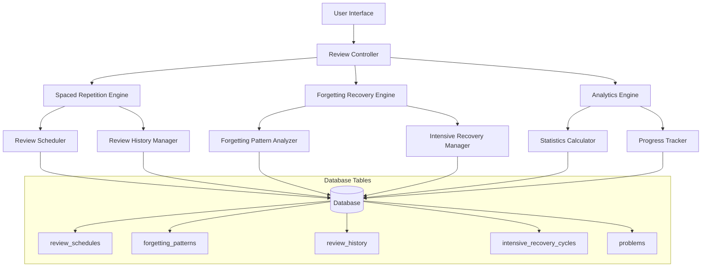
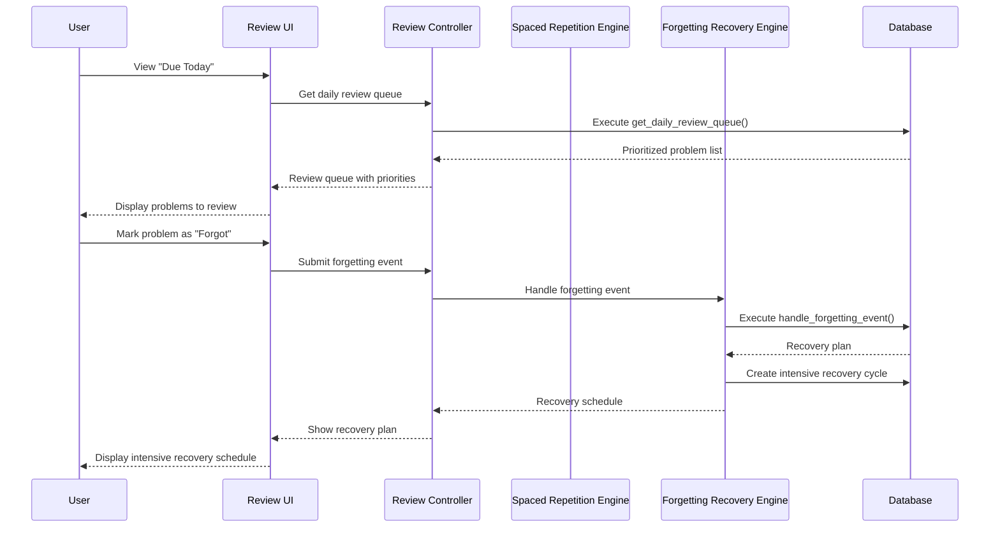

# Design Document

## Overview

The Spaced Repetition Review System implements a sophisticated memory retention system for LeetCode problems using research-based forgetting recovery patterns. The system uses daily-based intervals with intelligent recovery cycles that adapt to individual forgetting patterns. The core architecture consists of a review scheduler, forgetting recovery engine, intensive cycle manager, and analytics dashboard.

## Architecture

### High-Level Architecture



### Component Interaction Flow



## Components and Interfaces

### 1. Review Scheduler Component

**Purpose:** Manages the standard spaced repetition schedule progression

**Key Functions:**
- `calculateNextReviewDate(currentStage: number, result: 'remembered' | 'forgot'): Date`
- `getStandardInterval(stage: number): number`
- `scheduleInitialReview(problemId: number): void`

**Database Integration:**
- Uses `review_schedules` table for stage intervals
- Updates `review_history` with scheduled dates
- Follows 8-stage progression: 1→3→7→14→30→60→120→240 days

### 2. Forgetting Recovery Engine

**Purpose:** Implements intelligent recovery strategies based on forgetting patterns

**Key Functions:**
- `handleForgettingEvent(problemId: number, stage: number, timesForotten: number): RecoveryPlan`
- `createIntensiveRecoveryCycle(problemId: number, cycles: number): void`
- `processIntensiveReview(problemId: number, result: string): CycleStatus`

**Recovery Logic:**
```typescript
interface RecoveryPlan {
  resetIntervalDays: number;
  intensiveReviewCount: number;
  recoveryNotes: string;
  urgencyLevel: 1 | 2 | 3 | 4 | 5;
  estimatedRecoveryDays: number;
}

interface ForgettingPattern {
  stageForgotten: number;
  timesForotten: number;
  resetIntervalDays: number;
  intensiveReviewCount: number;
  recoveryNotes: string;
}
```

### 3. Daily Review Queue Manager

**Purpose:** Generates prioritized daily review lists

**Priority System:**
1. **Priority 1:** Intensive Recovery (daily practice needed)
2. **Priority 2:** Frequently Forgotten (2+ times in 90 days)
3. **Priority 3:** High Overdue (3+ days overdue)
4. **Priority 4:** Medium Overdue (1-2 days overdue)
5. **Priority 5:** On-time Reviews

**Queue Interface:**
```typescript
interface DailyReviewItem {
  problemId: number;
  problemTitle: string;
  difficulty: 'Easy' | 'Medium' | 'Hard';
  reviewType: 'NORMAL_REVIEW' | 'INTENSIVE_RECOVERY';
  priority: 1 | 2 | 3 | 4 | 5;
  daysOverdue: number;
  lastReviewDate: Date;
  timesForotten: number;
  patternNames: string;
}
```

### 4. Intensive Recovery Cycle Manager

**Purpose:** Manages daily intensive practice cycles for forgotten problems

**Cycle Management:**
- Tracks remaining cycles per problem
- Handles cycle progression and failures
- Manages graduation back to normal schedule

**Interface:**
```typescript
interface IntensiveRecoveryCycle {
  problemId: number;
  cyclesRemaining: number;
  cycleIntervalDays: number;
  startedDate: Date;
  completedDate?: Date;
}

interface CycleStatus {
  status: string;
  cyclesRemaining: number;
  nextReviewDate: Date;
  graduationStatus: string;
  daysUntilNormalCycle: number;
}
```

## Data Models

### Core Database Schema

Based on your provided schema, the system uses these key tables:

#### review_schedules
```sql
CREATE TABLE review_schedules (
    id BIGSERIAL PRIMARY KEY,
    stage INTEGER NOT NULL,
    interval_days INTEGER NOT NULL,
    description TEXT NOT NULL
);
```

#### forgetting_patterns
```sql
CREATE TABLE forgetting_patterns (
    id BIGSERIAL PRIMARY KEY,
    stage_forgotten INTEGER NOT NULL,
    times_forgotten INTEGER NOT NULL,
    reset_interval_days INTEGER NOT NULL,
    intensive_review_count INTEGER NOT NULL,
    recovery_notes TEXT NOT NULL,
    created_at TIMESTAMP DEFAULT CURRENT_TIMESTAMP
);
```

#### intensive_recovery_cycles
```sql
CREATE TABLE intensive_recovery_cycles (
    id BIGSERIAL PRIMARY KEY,
    problem_id BIGINT REFERENCES problems(id),
    cycles_remaining INTEGER NOT NULL,
    cycle_interval_days INTEGER NOT NULL,
    started_date DATE DEFAULT CURRENT_DATE,
    completed_date DATE
);
```

#### Enhanced review_history
```sql
-- Extends existing review_history table
ALTER TABLE review_history ADD COLUMN IF NOT EXISTS review_stage INTEGER;
ALTER TABLE review_history ADD COLUMN IF NOT EXISTS scheduled_review_time TIMESTAMP;
ALTER TABLE review_history ADD COLUMN IF NOT EXISTS time_spent_minutes INTEGER;
ALTER TABLE review_history ADD COLUMN IF NOT EXISTS actual_delay_hours NUMERIC;
```

### Frontend Data Models

```typescript
// Review Queue Models
interface ReviewQueueResponse {
  problems: DailyReviewItem[];
  summary: {
    totalDue: number;
    intensiveRecovery: number;
    overdue: number;
    onTime: number;
  };
}

// Review Action Models
interface ReviewAction {
  problemId: number;
  result: 'remembered' | 'forgot';
  timeSpent?: number;
  confusionNotes?: string;
  specificMistakes?: string[];
  customNextDate?: Date;
}

// Review History Models
interface ReviewHistoryEntry {
  id: number;
  reviewDate: Date;
  result: 'remembered' | 'forgot';
  reviewStage: number;
  nextScheduledDate: Date;
  timeSpent?: number;
  reviewNotes?: string;
  isIntensiveRecovery: boolean;
}

// Statistics Models
interface ReviewStatistics {
  totalProblemsInRotation: number;
  problemsDueToday: number;
  overdueProblems: number;
  intensiveRecoveryProblems: number;
  reviewStreak: number;
  weeklyCompletionRate: number;
  monthlyCompletionRate: number;
  forgettingRateByStage: Record<number, number>;
  averageRecoveryTime: number;
}
```

## Error Handling

### Database Function Error Handling

The PostgreSQL functions include comprehensive error handling:

```sql
-- Example error handling in forgetting recovery function
BEGIN
    -- Validation
    IF p_problem_id IS NULL OR p_forgotten_stage < 1 THEN
        RAISE EXCEPTION 'Invalid problem ID or stage';
    END IF;
    
    -- Recovery logic with fallbacks
    SELECT * INTO recovery_pattern 
    FROM forgetting_patterns 
    WHERE stage_forgotten = p_forgotten_stage
    AND times_forgotten = LEAST(forgetting_count + 1, 3)
    ORDER BY times_forgotten DESC 
    LIMIT 1;
    
    -- Fallback if no pattern found
    IF recovery_pattern IS NULL THEN
        recovery_pattern := (1, 1, 1, 2, 'Default recovery pattern');
    END IF;
    
EXCEPTION
    WHEN OTHERS THEN
        -- Log error and return safe defaults
        INSERT INTO error_log (function_name, error_message, problem_id)
        VALUES ('handle_forgetting_event', SQLERRM, p_problem_id);
        
        RETURN QUERY SELECT 
            'Error occurred - using default recovery'::TEXT,
            CURRENT_DATE + 1,
            2,
            ARRAY['Review problem basics', 'Practice similar problems']::TEXT[],
            3,
            2;
END;
```

### Frontend Error Handling

```typescript
class ReviewService {
  async submitReview(action: ReviewAction): Promise<ReviewResult> {
    try {
      const response = await api.post('/api/reviews', action);
      return response.data;
    } catch (error) {
      if (error.status === 400) {
        throw new ValidationError('Invalid review data');
      } else if (error.status === 500) {
        // Fallback to local calculation
        return this.calculateFallbackSchedule(action);
      }
      throw new NetworkError('Failed to submit review');
    }
  }
  
  private calculateFallbackSchedule(action: ReviewAction): ReviewResult {
    // Simple fallback logic when server is unavailable
    const nextDate = action.result === 'forgot' 
      ? new Date(Date.now() + 24 * 60 * 60 * 1000) // Tomorrow
      : new Date(Date.now() + 3 * 24 * 60 * 60 * 1000); // 3 days
      
    return {
      nextReviewDate: nextDate,
      message: 'Offline mode - basic scheduling applied',
      intensiveRecovery: action.result === 'forgot'
    };
  }
}
```

## Testing Strategy

### Unit Testing

**Database Functions:**
```sql
-- Test forgetting recovery patterns
SELECT * FROM handle_forgetting_event(1, 1, 25, 'Test forgetting at stage 1');
SELECT * FROM handle_forgetting_event(1, 2, 30, 'Test forgetting at critical 3-day cliff');
SELECT * FROM handle_forgetting_event(1, 2, 20, 'Second time forgetting same stage');

-- Test daily review queue
SELECT * FROM get_daily_review_queue(CURRENT_DATE);
SELECT * FROM get_daily_review_queue(CURRENT_DATE - 5); -- Test overdue problems

-- Test intensive recovery cycles
SELECT * FROM process_daily_intensive_recovery(1, 'remembered', 'Successful practice');
SELECT * FROM process_daily_intensive_recovery(1, 'forgot', 'Still struggling');
```

**Frontend Components:**
```typescript
describe('ReviewQueue', () => {
  test('prioritizes intensive recovery problems', () => {
    const queue = [
      { priority: 1, reviewType: 'INTENSIVE_RECOVERY' },
      { priority: 3, reviewType: 'NORMAL_REVIEW' }
    ];
    expect(queue[0].priority).toBe(1);
  });
  
  test('handles forgetting event correctly', async () => {
    const result = await reviewService.submitReview({
      problemId: 1,
      result: 'forgot',
      timeSpent: 25
    });
    expect(result.intensiveRecovery).toBe(true);
  });
});
```

### Integration Testing

**End-to-End Review Flow:**
1. Mark problem as solved → verify initial review scheduled
2. Complete review as "remembered" → verify stage progression
3. Complete review as "forgot" → verify intensive recovery cycle creation
4. Complete intensive cycles → verify graduation to normal schedule

**Performance Testing:**
- Test daily queue generation with 1000+ problems
- Test forgetting recovery calculation performance
- Test concurrent review submissions

### User Acceptance Testing

**Scenarios:**
1. **New User Journey:** Solve first problem → see it in "Due Today" tomorrow → complete review cycle
2. **Forgetting Recovery:** Forget problem at different stages → verify appropriate recovery plans
3. **Intensive Recovery:** Complete daily intensive cycles → verify graduation
4. **Statistics Tracking:** Complete multiple reviews → verify accurate statistics

## Performance Considerations

### Database Optimization

**Indexes:**
```sql
-- Critical indexes for performance
CREATE INDEX idx_review_history_problem_scheduled ON review_history(problem_id, scheduled_review_time);
CREATE INDEX idx_intensive_recovery_active ON intensive_recovery_cycles(problem_id, completed_date) WHERE completed_date IS NULL;
CREATE INDEX idx_review_history_result_date ON review_history(result, review_date) WHERE review_date >= CURRENT_DATE - 90;
```

**Query Optimization:**
- Use materialized views for complex statistics
- Implement query result caching for daily review queues
- Optimize forgetting pattern lookups with prepared statements

### Frontend Performance

**Caching Strategy:**
```typescript
class ReviewCache {
  private dailyQueueCache: Map<string, ReviewQueueResponse> = new Map();
  private statisticsCache: ReviewStatistics | null = null;
  private cacheExpiry: number = 5 * 60 * 1000; // 5 minutes
  
  async getDailyQueue(date: string): Promise<ReviewQueueResponse> {
    const cached = this.dailyQueueCache.get(date);
    if (cached && this.isValid(cached.timestamp)) {
      return cached;
    }
    
    const fresh = await api.getDailyQueue(date);
    this.dailyQueueCache.set(date, { ...fresh, timestamp: Date.now() });
    return fresh;
  }
}
```

**Lazy Loading:**
- Load review history on demand
- Paginate large review queues
- Defer statistics calculation until requested

## Security Considerations

### Data Protection
- Encrypt sensitive review notes and confusion details
- Implement rate limiting on review submissions
- Validate all user inputs before database operations

### Access Control
- Ensure users can only access their own review data
- Implement session-based authentication for review actions
- Log all review modifications for audit trail

### Database Security
```sql
-- Row-level security for review data
ALTER TABLE review_history ENABLE ROW LEVEL SECURITY;
CREATE POLICY review_history_user_policy ON review_history
    FOR ALL TO app_user
    USING (problem_id IN (SELECT id FROM problems WHERE user_id = current_user_id()));
```